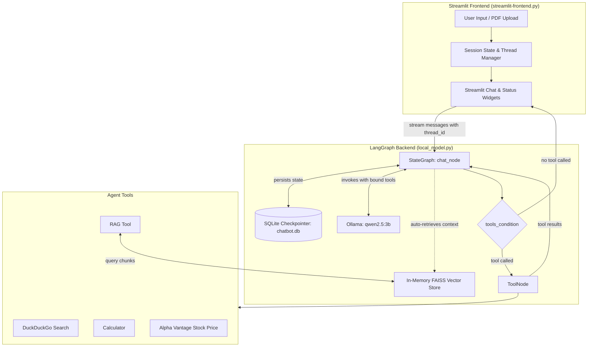
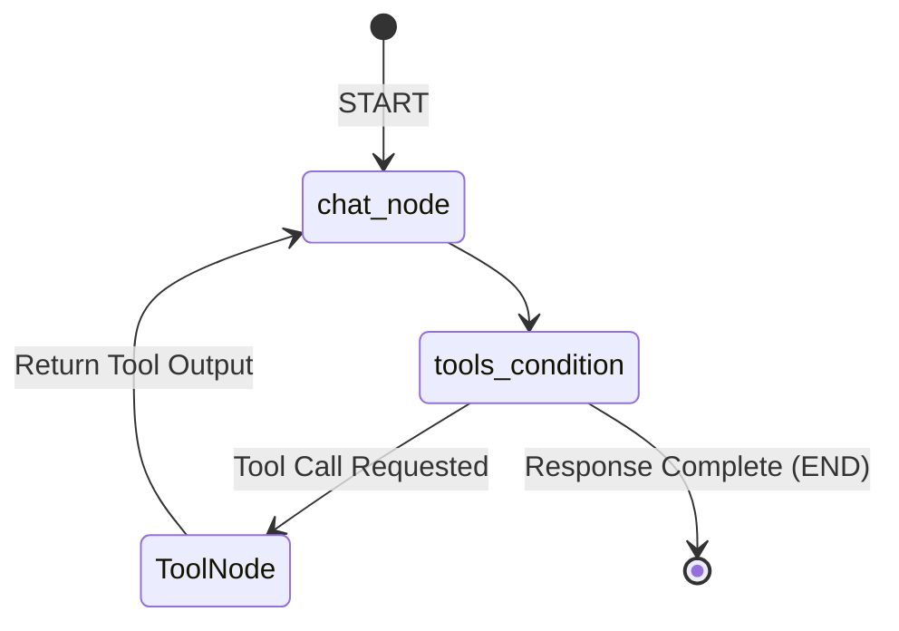
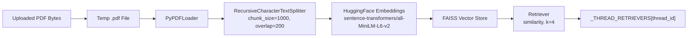

# Multi-Utility LangGraph PDF Chatbot

A local-first, multi-utility AI conversational assistant built with **LangGraph**, **LangChain**, **Streamlit**, **Ollama**, **FAISS**, and **SQLite**. 

The entire system is powered by two core files:
- [`local_model.py`](file:///d:/Projects/LangGraph%20Chatbot/local_model.py) — The LangGraph agent backend, local LLM configuration, custom tools, thread-isolated RAG pipeline, and SQLite checkpoint persistence.
- [`streamlit-frontend.py`](file:///d:/Projects/LangGraph%20Chatbot/streamlit-frontend.py) — The interactive Streamlit user interface featuring multi-thread conversation history, PDF upload & indexing, real-time message streaming, and live tool execution status.

---

## 🌟 Key Features

- **Local LLM Execution**: Uses **Ollama** running `qwen2.5:3b` locally for private, zero-latency cloud inference without external LLM API costs.
- **Thread-Isolated PDF RAG**: Upload PDF documents per chat session. Documents are chunked, embedded with HuggingFace (`all-MiniLM-L6-v2`), indexed into an in-memory **FAISS** vector store, and bound directly to the active thread ID.
- **Dual-Mode Document Context**:
  - **Automated Context Injection**: Automatically retrieves the top $k=4$ relevant document chunks for user queries and injects them directly into the system prompt.
  - **RAG Tool**: A dedicated tool (`rag_tool`) allowing the model to explicitly query the document index if needed.
- **Built-in Tool Ecosystem**:
  - 🔍 **Web Search**: Real-time web queries via `DuckDuckGoSearchRun`.
  - 🧮 **Calculator**: Arithmetic calculations (`add`, `sub`, `mul`, `div`) with zero-division error handling.
  - 📈 **Stock Price**: Live market data lookup via Alpha Vantage `GLOBAL_QUOTE`.
  - 📄 **RAG Retrieval**: On-demand similarity retrieval against thread-indexed documents.
- **Persistent Conversation Memory**: State checkpoints are saved directly to a local SQLite database (`chatbot.db`) via `SqliteSaver`, allowing past conversations to be resumed across application restarts.
- **Multi-Thread Management**: Unique UUID-based thread management enabling users to start new sessions, switch between historical threads, and maintain isolated document contexts.
- **Interactive Streaming UI**: Real-time response streaming using `st.write_stream()` and dynamic tool execution indicators with `st.status()`.

---

## 🏗️ Architecture Overview

The application couples a Streamlit frontend with a LangGraph state machine backend:



---

## 🔄 LangGraph Workflow

The agent graph in [`local_model.py`](file:///d:/Projects/LangGraph%20Chatbot/local_model.py) is compiled with an active SQLite checkpointer:



### Execution Steps:
1. **Thread Identification**: `chat_node` extracts `thread_id` from the LangGraph `config` (`configurable` or `metadata`).
2. **Context Enrichment**: If an indexed PDF retriever exists for the current thread, the last human message is queried against the retriever ($k=4$). The retrieved chunks are formatted into a `DOCUMENT CONTEXT` block and injected into the `SystemMessage`.
3. **System Prompt Formulation**: System instructions mandate when to use the calculator, search, stock quote, or document context.
4. **LLM Invocation**: The model (`qwen2.5:3b` bound with `tools`) is invoked with the system message and state message history.
5. **Conditional Routing**: `tools_condition` inspects the output:
   - If a tool call is generated, execution routes to `ToolNode(tools)`.
   - The tool output is appended to the state as a `ToolMessage` and routed back to `chat_node`.
   - If no tool call is generated, execution concludes and streams back to the frontend.

---

## 📄 PDF Ingestion & RAG Pipeline

PDF processing is managed dynamically per chat thread within [`local_model.py`](file:///d:/Projects/LangGraph%20Chatbot/local_model.py):



- **Chunking Strategy**: `chunk_size = 1000`, `chunk_overlap = 200`, separators: `["\n\n", "\n", " ", ""]`.
- **Embeddings**: `sentence-transformers/all-MiniLM-L6-v2` loaded via `HuggingFaceEmbeddings`.
- **Thread Isolation**: Retrievers are stored in memory in `_THREAD_RETRIEVERS[thread_id]`, ensuring documents uploaded in one conversation do not bleed into others.
- **Thread Metadata**: Page counts and chunk counts are tracked in `_THREAD_METADATA[thread_id]` and displayed in the frontend.

---

## 🧰 Available Agent Tools

Defined in [`local_model.py`](file:///d:/Projects/LangGraph%20Chatbot/local_model.py):

| Tool | Function / Class | Description | Inputs |
| :--- | :--- | :--- | :--- |
| **Web Search** | `DuckDuckGoSearchRun(region="us-en")` | Searches the live web for up-to-date information. | `query` (str) |
| **Calculator** | `@tool calculator(...)` | Performs basic arithmetic (`add`, `sub`, `mul`, `div`). Handles divide-by-zero safely. | `first_num` (float), `second_num` (float), `operation` (str) |
| **Stock Price** | `@tool get_stock_price(...)` | Queries Alpha Vantage `GLOBAL_QUOTE` API for current equity quotes. | `symbol` (str, e.g. `AAPL`, `TSLA`) |
| **RAG Retrieval** | `@tool rag_tool(...)` | Queries the thread's indexed PDF vector store and returns matching passages. | `query` (str) |

---

## 🖥️ Streamlit Frontend Layout

Defined in [`streamlit-frontend.py`](file:///d:/Projects/LangGraph%20Chatbot/streamlit-frontend.py):

### Sidebar Controls
- **Thread Info**: Displays the active session's `thread_id` (UUID).
- **New Chat Button**: Generates a fresh UUID, resets current message history, and reruns the session.
- **Document Status**: Displays active document summary (filename, page count, chunk count) or an alert if no document is uploaded.
- **PDF File Uploader**: Accepts `.pdf` files, streams ingestion status with `st.sidebar.status("Indexing PDF…")`, and registers the retriever.
- **Past Conversations**: Lists all existing thread IDs stored in SQLite via `retrieve_all_threads()`. Clicking any thread loads its complete message history and restores the conversation.

### Main Chat Window
- **Chat History**: Renders past dialogue using `st.chat_message`.
- **Streaming Response**: Real-time token streaming using `chatbot.stream(..., stream_mode="messages")`.
- **Live Tool Tracking**: Detects `ToolMessage` events during graph execution and displays expandable status widgets (`st.status("🔧 Using <tool_name> …")`).
- **Document Caption**: Shows document indexing metadata beneath assistant responses when applicable.

---

## 📁 Repository Structure

```text
.
├── local_model.py          # LangGraph graph, Ollama LLM, tools, RAG logic, and SQLite persistence
├── streamlit-frontend.py   # Streamlit UI, chat streaming, thread switcher, and PDF uploader
├── .env                    # Environment variables (HuggingFace token)
├── chatbot.db              # SQLite database storing conversation checkpoints
├── chatbot.db-wal          # SQLite write-ahead log
├── chatbot.db-shm          # SQLite shared memory file
├── requirements.txt        # Project package dependencies
└── readme.md               # Project documentation
```

---

## ⚙️ Installation & Setup

### 1. Clone the Repository
```bash
git clone <repository-url>
cd "LangGraph Chatbot"
```

### 2. Create and Activate a Virtual Environment
**Windows (PowerShell):**
```powershell
python -m venv venv
.\venv\Scripts\Activate.ps1
```

**Linux / macOS:**
```bash
python3 -m venv venv
source venv/bin/activate
```

### 3. Install Dependencies
```bash
pip install streamlit langgraph langchain langchain-core langchain-community langchain-ollama langchain-huggingface langchain-text-splitters sentence-transformers faiss-cpu pypdf python-dotenv requests duckduckgo-search
```

### 4. Setup Ollama & Pull the Model
Ensure [Ollama](https://ollama.com/) is installed and running on your machine:
```bash
ollama pull qwen2.5:3b
```
Verify the model is available:
```bash
ollama list
```

### 5. Configure Environment Variables
Create a `.env` file in the project root:
```env
HF_TOKEN=your_huggingface_access_token_here
```
> [!IMPORTANT]
> `local_model.py` requires `HF_TOKEN` in `.env` to initialize HuggingFace embeddings. If missing, it raises a `ValueError`.

---

## ▶️ Running the Application

1. **Ensure Ollama service is active**:
   ```bash
   ollama serve
   ```
2. **Start the Streamlit application**:
   ```bash
   streamlit run streamlit-frontend.py
   ```
3. Open your browser at the local URL provided by Streamlit (default: `http://localhost:8501`).

---

## 📊 Technology Stack

| Technology | Role in Project | Sourced In |
| :--- | :--- | :--- |
| **Streamlit** | Interactive UI, sidebar, file uploader, streaming output | [`streamlit-frontend.py`](file:///d:/Projects/LangGraph%20Chatbot/streamlit-frontend.py) |
| **LangGraph** | Graph state orchestration, conditional branching (`tools_condition`) | [`local_model.py`](file:///d:/Projects/LangGraph%20Chatbot/local_model.py) |
| **LangChain** | Message abstractions, tool wrappers, document loaders, text splitters | Both |
| **ChatOllama (`qwen2.5:3b`)** | Local LLM inference engine | [`local_model.py`](file:///d:/Projects/LangGraph%20Chatbot/local_model.py) |
| **HuggingFace Embeddings** | Generates vector embeddings using `all-MiniLM-L6-v2` | [`local_model.py`](file:///d:/Projects/LangGraph%20Chatbot/local_model.py) |
| **FAISS** | Fast in-memory similarity search for chunked PDF context | [`local_model.py`](file:///d:/Projects/LangGraph%20Chatbot/local_model.py) |
| **PyPDF (`PyPDFLoader`)** | Extracts text from uploaded PDF documents | [`local_model.py`](file:///d:/Projects/LangGraph%20Chatbot/local_model.py) |
| **SQLite (`SqliteSaver`)** | Persistent graph checkpoints stored in `chatbot.db` | [`local_model.py`](file:///d:/Projects/LangGraph%20Chatbot/local_model.py) |
| **DuckDuckGo Search** | Real-time web search tool | [`local_model.py`](file:///d:/Projects/LangGraph%20Chatbot/local_model.py) |
| **Alpha Vantage** | Stock market quotes via `GLOBAL_QUOTE` | [`local_model.py`](file:///d:/Projects/LangGraph%20Chatbot/local_model.py) |

